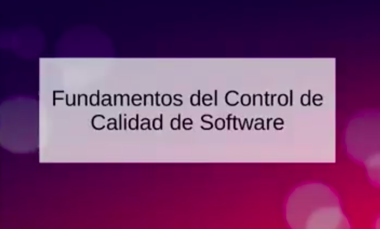
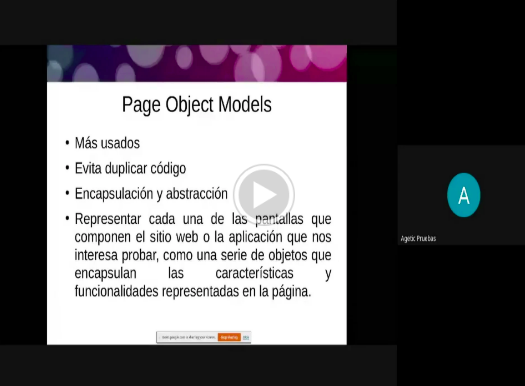
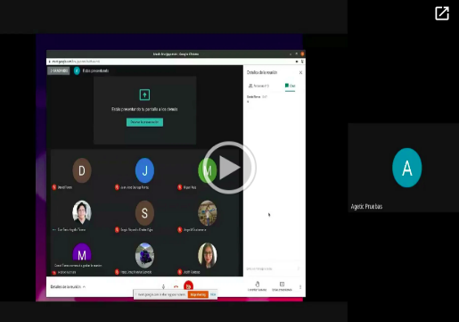
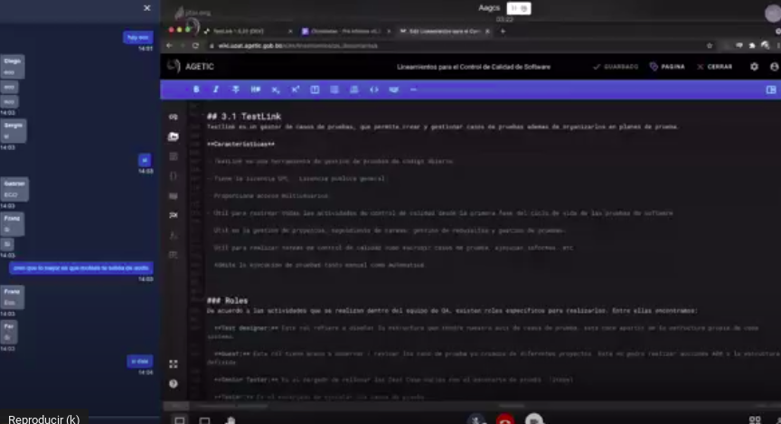

# Introducción a SQA

Material audiovisual y de lectura para el inicio en el área de QA. Se tienen tres lecturas iniciales y cuatro videos de orientación y aplicación.

Lectura:

1) [Lectura Inicial](Inicio.md)
1) [Introducción SQA](IntroduccionSQA.md)
1) [Introducción a Herramientas Propuestas](IntroduccionSQAHerramientas.md)

## Material Audiovisual - Curso QA
Videos de consulta:

Primera sesión:
https://drive.google.com/file/d/1I4PdvlyPIkRU83USdN5_V9xR9xlGwPM6/view?usp=sharing

Segunda sesión:
https://drive.google.com/file/d/1DWwsPQOKOabwEjXQ6jzjKpT5hkmukhKK/view?usp=sharing

Tercera sesión:
https://drive.google.com/file/d/1u5Qg1PiKyVDz3_iENi8Gedv6aqd__XNy/view?usp=sharing

Cuarta sesión:
https://drive.google.com/file/d/16gWvBBIlLGk2NaTN5hwi5dTY1HHPVcJs/view?usp=sharing

